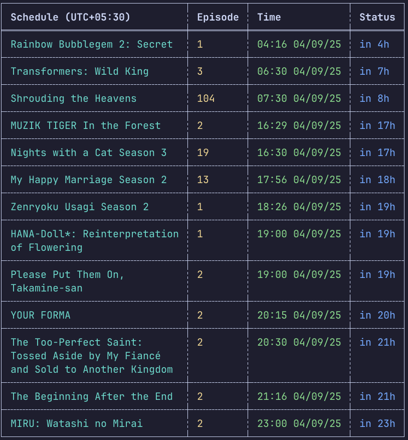
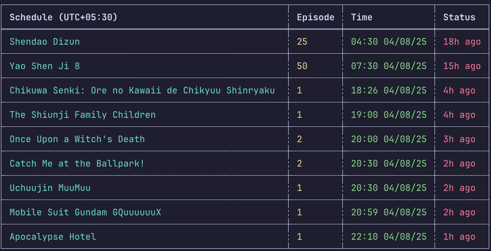

# 🎬 Anime Schedule CLI

<div align="center">



[](https://crates.io/crates/animesh)
[](https://opensource.org/licenses/MIT)

A powerful command-line tool to track your favorite anime shows and discover new releases from AniList.

[Features](#features) • [Installation](#installation) • [Usage](#usage) • [Examples](#examples)

</div>

## ✨ Features

- 📅 View upcoming anime airing schedules
- ⏰ Real-time countdown to next episodes
- 🔄 Customizable time range
- 🌍 Global timezone support
- 🎨 Beautiful terminal output with colors
- 📱 Mobile-friendly interface

## 🚀 Installation

### Using Cargo (Recommended)

```bash
cargo install animesh
```

### Using Release Assets

1. Visit the [Releases](https://github.com/Abhi-Gautam/animesh/releases) page
2. Download the appropriate asset for your platform:
   - Windows: `animesh-windows.zip`
   - macOS: `animesh-macos.tar.gz`
   - Linux: `animesh-linux.tar.gz`
3. Extract the archive
4. Add the binary to your PATH:

#### Windows
```powershell
# Add to PATH for current user
$env:Path += ";C:\path\to\extracted\folder"
# Or add to system PATH through System Properties > Environment Variables
```

#### macOS/Linux
```bash
# Move binary to a directory in your PATH
sudo mv animesh /usr/local/bin/
# Or add to PATH in your shell config (~/.bashrc, ~/.zshrc, etc.)
export PATH="$PATH:/path/to/extracted/folder"
```

## 📖 Usage

### View Schedule

```bash
# Show schedule for next 1 day (default)
animesh schedule

# Show schedule for next 7 days
animesh schedule --interval 7

# Show schedule in a specific timezone
animesh schedule --timezone "IST"

# Show past episodes from last 3 days
animesh schedule --interval 3 --past
```



## 🌍 Timezone Support

The tool supports various timezone formats:
- Standard timezone names (e.g., "UTC", "IST", "JST")
- UTC offsets (e.g., "UTC+5:30", "UTC-4:00")
- IANA/Olson timezone database names (e.g., "America/New_York", "Europe/London")

If no timezone is specified, the tool will try to fallback to your current time zone.

## 🤝 Contributing

Contributions are welcome! Please feel free to submit a Pull Request.

1. Fork the repository
2. Create your feature branch (`git checkout -b feature/amazing-feature`)
3. Commit your changes (`git commit -m 'Add some amazing feature'`)
4. Push to the branch (`git push origin feature/amazing-feature`)
5. Open a Pull Request

## 📝 License

This project is licensed under the MIT License - see the [LICENSE](LICENSE) file for details.

## 🙏 Acknowledgments

- [AniList](https://anilist.co/) for their amazing API
- [chrono-tz](https://github.com/chronotope/chrono-tz) for timezone support
- All the contributors who help improve this project